When a Domain Controller (DC) is powered off permanently, lost, or improperly demoted, Active Directory can keep stale references to it. These leftovers cause replication errors, DNS inconsistencies, and problems with FSMO transfers or new DC promotions. This guide covers both the GUI and command-line ways to clean it up.

## Which Method to Use

- **DC is still reachable** → use **Method 1: Server Manager** below. This is Microsoft's recommended graceful demotion path.
- **DC is dead / unreachable** → use **Method 2: ADUC** below.
- On Windows Server 2008 and later, both of the above trigger metadata cleanup automatically. The manual **ntdsutil** steps (Method 3) are only needed as a fallback — e.g., the object is already gone but stale references remain, or the automatic cleanup fails.

> **Warning:** Only remove a DC's metadata if it's confirmed permanently gone. Running the manual cleanup steps against a DC that's still alive (temporarily unreachable, network partition, etc.) will corrupt replication. Confirm FSMO roles have been transferred/seized and that you have a recent AD backup before proceeding with any of these methods.

## Prerequisites

- The failed DC will **never** return to service (for Methods 2 and 3).
- FSMO roles held by the DC have been transferred or seized — check with `netdom query fsmo`.
- No other services (DNS, DHCP, etc.) still depend on the server.
- You have a recent AD backup.
- Replication on remaining DCs is healthy.

---

## Method 1: Demote via Server Manager (DC Still Reachable)

Use this when you still have access to the server itself.

1. Open **Server Manager**.

   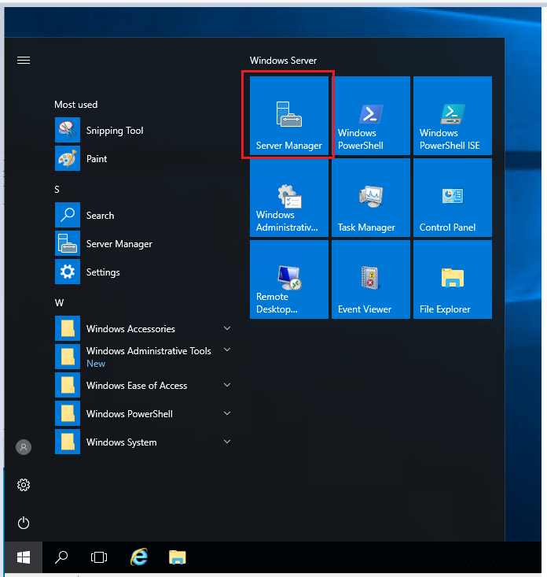

2. Go to **Manage → Remove Roles and Features**.

   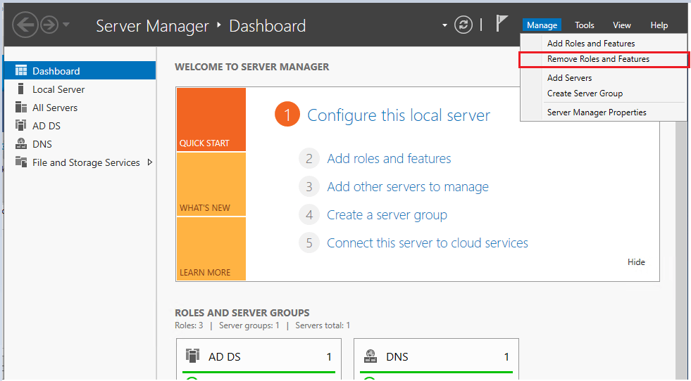

3. On the **Server Selection** page, pick the server you're demoting and click Next.

   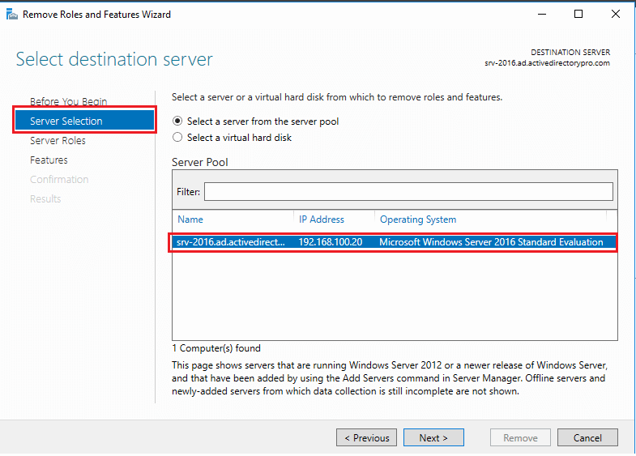

4. On the **Server Roles** page, uncheck **Active Directory Domain Services**.

   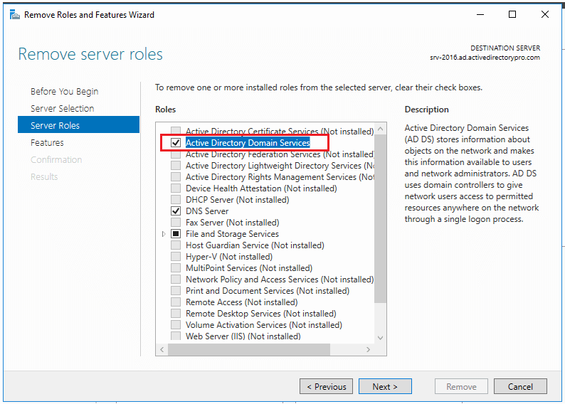

   You'll get a popup asking to remove dependent management tools/features — keep them if you plan to reuse the server to manage AD, remove them if you're decommissioning it.

   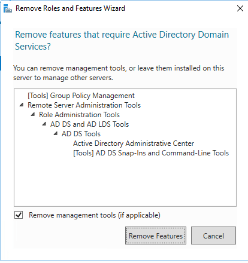

5. Select **Demote this domain controller** when prompted.

   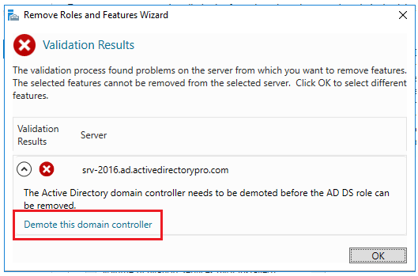

6. On the credentials page, **do not** check "Force the removal of this domain controller" unless this is the last DC in the domain. Adjust credentials here if needed, then click Next.

   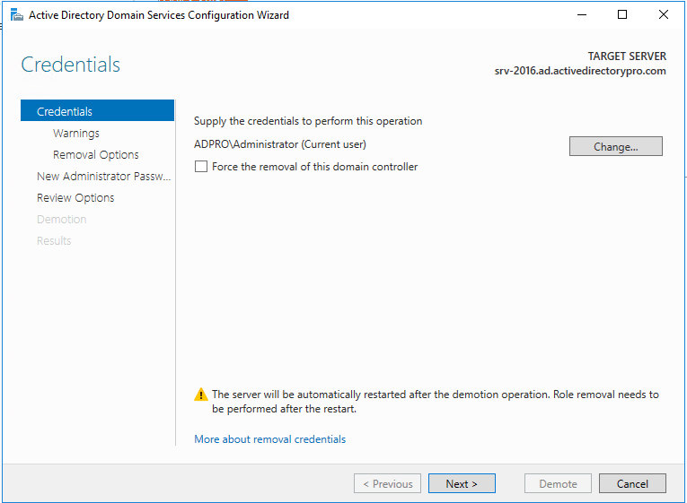

7. On the warnings page, acknowledge any notice about additional roles hosted on the server (e.g., DNS) — remember to repoint any clients using this server for DNS. Check **Proceed with removal** and click Next.

   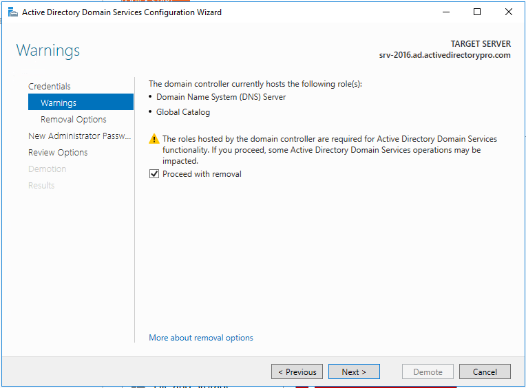

8. On the removal options page, choose whether to remove DNS delegation (most environments won't have this set and can leave it unchecked). Click Next.

   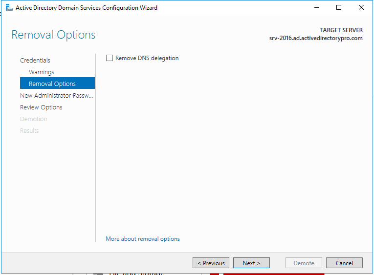

9. Set the new **local Administrator password** for the server once it's a member server. Click Next.

   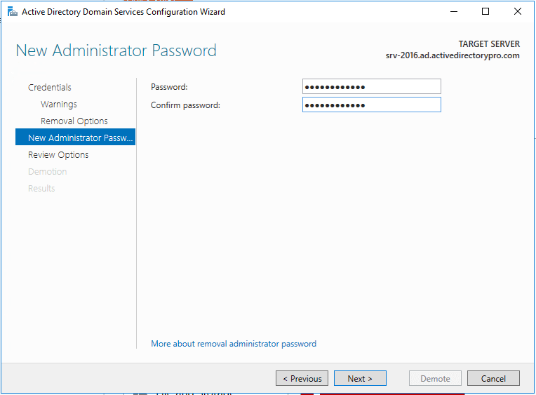

10. Review the summary and click **Demote**. There's a **View Script** button here that generates the equivalent PowerShell — useful if you have more than one DC to demote and want to script the rest.

    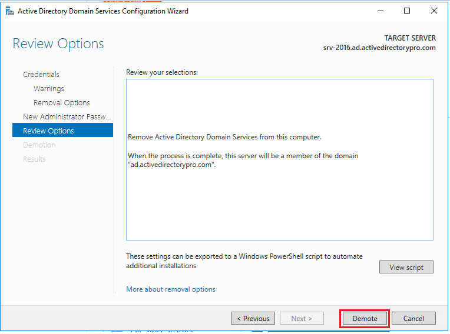

The server reboots and comes back up as a domain member. Metadata cleanup happens automatically as part of this process.

---

## Method 2: Manually Remove via ADUC (Dead / Unreachable DC)

Use this when the server is dead, disconnected, or you no longer have access to it.

1. On another DC or a machine with RSAT tools, open **Active Directory Users and Computers**, go to the **Domain Controllers** OU, right-click the dead DC's computer object, and choose **Delete**.

   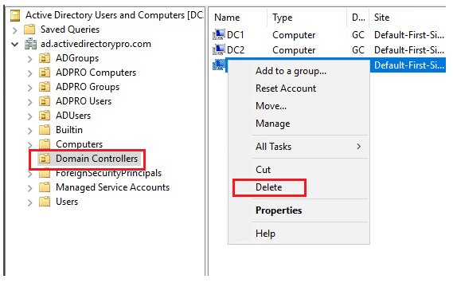

2. On the confirmation dialog, check **"Delete this Domain Controller anyway"** and click Delete.

   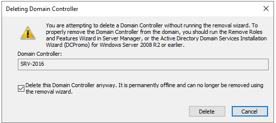

3. If the DC was a Global Catalog server, you'll get an additional confirmation — click Yes.

Since Server 2008, this single deletion also triggers the automatic metadata cleanup behind the scenes — the manual `ntdsutil` process below is a fallback, not a required follow-up.

---

## Method 3 (Fallback): Manual Metadata Cleanup with ntdsutil

Use this only if Methods 1/2 aren't available or didn't fully clean things up (e.g., the computer object is already gone but AD still shows stale references).

### Step 1: Verify the Failed Domain Controller

```powershell
repadmin /replsummary
```

```powershell
repadmin /showrepl
```

```powershell
dcdiag /v
```

### Step 2: Start ntdsutil

Open an elevated Command Prompt.

```cmd
ntdsutil
```

### Step 3: Enter Metadata Cleanup Mode

```cmd
metadata cleanup
```

### Step 4: Connect to a Healthy Domain Controller

```cmd
connections
```

```cmd
connect to server SERVER100
```

```cmd
q
```

*(Replace `SERVER100` with a healthy, operational DC in your environment.)*

### Step 5: Select the Failed Domain Controller

```cmd
select operation target
```

```cmd
list domains
```

```cmd
select domain 0
```

```cmd
list sites
```

```cmd
select site 0
```

```cmd
list servers in site
```

```cmd
select server 0
```

```cmd
q
```

Double-check the output confirms you selected the **failed** DC, not the healthy one.

### Step 6: Remove the Selected Server

```cmd
remove selected server
```

```cmd
quit
```

```cmd
quit
```

### Full Script (Copy-Paste All Steps)

```cmd
ntdsutil
metadata cleanup
connections
connect to server HEALTHY-DC
q
select operation target
list domains
select domain <NUMBER>
list sites
select site <NUMBER>
list servers in site
select server <NUMBER>
q
remove selected server
quit
quit
```

---

## Additional Cleanup (Applies to All Methods): Sites and Services

Microsoft doesn't automatically clean this up with **any** of the methods above — it's the step most guides skip.

1. Open **Active Directory Sites and Services**.
2. Expand **Sites → [your site] → Servers**.
3. If the removed DC's server object is still listed, right-click it and delete it.

   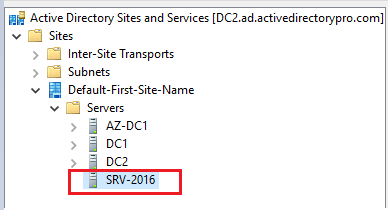

---

## Post-Cleanup Validation

### 1. Remove DNS Records

Three record types to clean up:

- **A record** in the forward lookup zone, named after the server.
- **CNAME record** in the `_msdcs.<forestroot>` zone — this record is named by the DC's NTDS Settings **objectGUID**, not the server name, so look it up before deleting.
- **PTR record** in the relevant reverse lookup zone.

```powershell
Remove-DnsServerResourceRecord -ZoneName "dorg.net" -RRType "A" -Name "SERVER200" -Force
```

```powershell
Remove-DnsServerResourceRecord -ZoneName "_msdcs.dorg.net" -RRType "CName" -Name "<DC-NTDS-GUID>" -Force
```

```powershell
Remove-DnsServerResourceRecord -ZoneName "10.10.10.in-addr.arpa" -RRType "Ptr" -Name "200" -Force
```

### 2. Validate Replication

```powershell
repadmin /replsummary
```

```powershell
repadmin /showrepl
```

```powershell
dcdiag /test:dns
```

```powershell
Get-ADDomainController -Filter *
```

### 3. Confirm No Remaining Metadata

```powershell
Get-ADComputer SERVER200
```

```powershell
Get-ADObject -LDAPFilter "(cn=SERVER200)"
```

## Verification Checklist

- [ ] DC removed via Server Manager, ADUC, or `ntdsutil`
- [ ] Server object removed from Sites and Services
- [ ] DNS A record removed
- [ ] `_msdcs` CNAME removed
- [ ] PTR record removed
- [ ] AD replication healthy
- [ ] `dcdiag` passes

## Summary

If the DC is reachable, demote it gracefully through Server Manager — Microsoft's recommended path. If it's dead, delete the computer object in ADUC; since Server 2008 this alone triggers metadata cleanup automatically. Fall back to manual `ntdsutil` cleanup only when neither of those fully clears the stale references. Whichever path you take, don't forget Sites and Services — it's the step most commonly left behind.

## References

- [Active Directory Pro — How to Demote a Domain Controller](https://activedirectorypro.com/demote-domain-controller/)


