When a Domain Controller (DC) is powered off permanently, lost, or improperly demoted, Active Directory can keep stale references to it. These leftovers cause replication errors, DNS inconsistencies, and problems with FSMO transfers or new DC promotions. This guide covers both the GUI and command-line ways to clean it up.

## Which Method to Use

- **DC is still reachable** → use **Method 1: Server Manager** below. This is Microsoft's recommended graceful demotion path.
- **DC is dead / unreachable, GUI available** → use **Method 2: ADUC** below.
- **DC is dead / unreachable, scripted or remote (no GUI)** → use **Method 3: PowerShell** below.
- On Windows Server 2008 and later, Methods 2 and 3 both trigger metadata cleanup automatically — deleting the DC's NTDS Settings object is what actually does it, whether that happens via ADUC's wizard or a PowerShell cmdlet. The manual **ntdsutil** steps (Method 4) are only needed as a fallback — e.g., the object is already gone but stale references remain, or the automatic cleanup fails.
- **DC is an RODC** → see the note after Method 2; the removal flow and considerations differ.

> **Warning:** Only remove a DC's metadata if it's confirmed permanently gone. Running the manual cleanup steps against a DC that's still alive (temporarily unreachable, network partition, etc.) will corrupt replication. Confirm FSMO roles have been transferred/seized and that you have a recent AD backup before proceeding with any of these methods.

## Prerequisites

- The failed DC will **never** return to service (for Methods 2–4).
- FSMO roles held by the DC have been transferred or seized — check with `netdom query fsmo` (see below if you need to seize).
- **Permissions:** Enterprise Admins if the DC was a Global Catalog or held forest-wide/cross-domain objects; Domain Admins is enough for single-domain cleanup.
- No other services (DNS, DHCP, etc.) still depend on the server.
- You have a recent AD backup.
- Replication on remaining DCs is healthy.

### Seizing FSMO Roles (If Not Already Transferred)

If `netdom query fsmo` shows the dead DC still holding a role, seize it from a healthy DC before continuing — don't run all five seize commands blindly, only the roles the dead DC actually held:

```cmd
ntdsutil
roles
connections
connect to server HEALTHY-DC
q
seize schema master
seize naming master
seize pdc
seize rid master
seize infrastructure master
quit
quit
```

---

## Method 1: Demote via Server Manager (DC Still Reachable)

Use this when you still have access to the server itself.

1. Open **Server Manager**.

   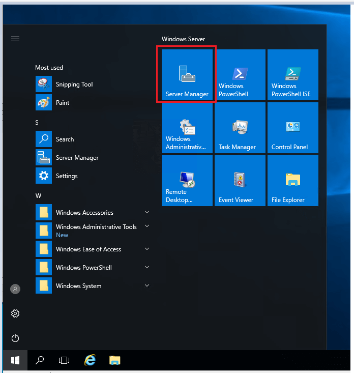

2. Go to **Manage → Remove Roles and Features**.

   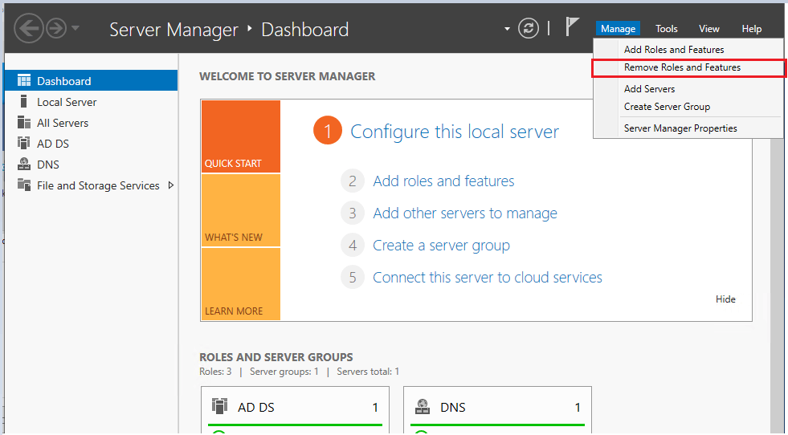

3. On the **Server Selection** page, pick the server you're demoting and click Next.

   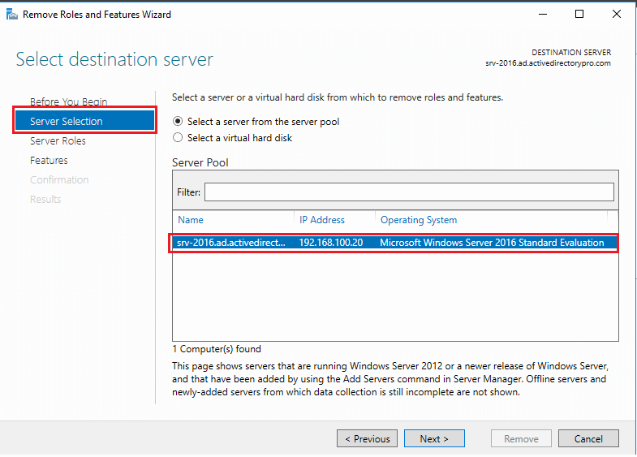

4. On the **Server Roles** page, uncheck **Active Directory Domain Services**.

   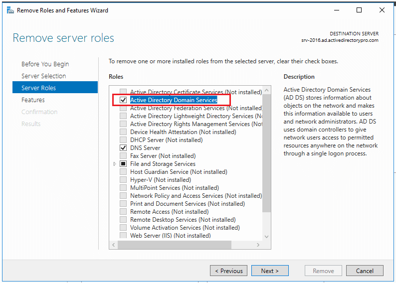

   You'll get a popup asking to remove dependent management tools/features — keep them if you plan to reuse the server to manage AD, remove them if you're decommissioning it.

   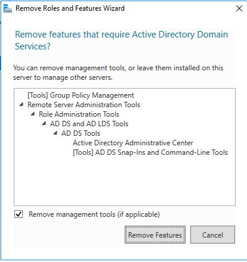

5. Select **Demote this domain controller** when prompted.

   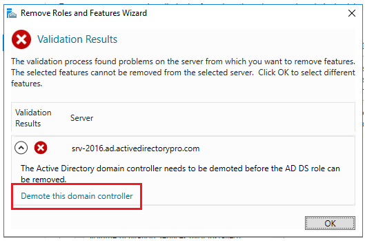

6. On the credentials page, **do not** check "Force the removal of this domain controller" unless this is the last DC in the domain. Adjust credentials here if needed, then click Next.

   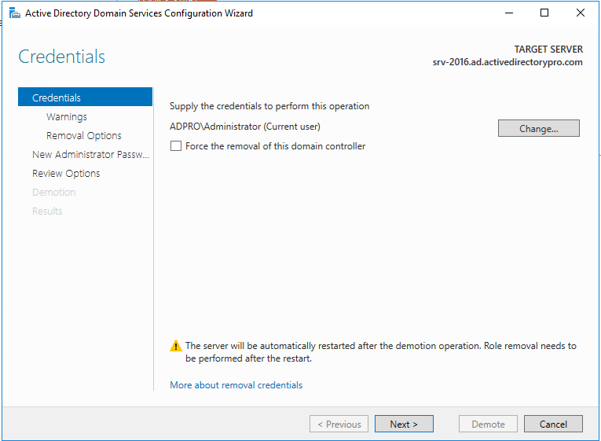

7. On the warnings page, acknowledge any notice about additional roles hosted on the server (e.g., DNS) — remember to repoint any clients using this server for DNS. Check **Proceed with removal** and click Next.

   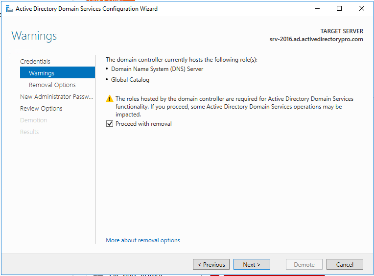

8. On the removal options page, choose whether to remove DNS delegation (most environments won't have this set and can leave it unchecked). Click Next.

   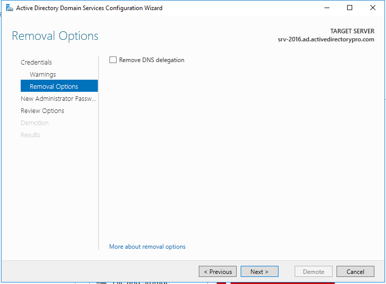

9. Set the new **local Administrator password** for the server once it's a member server. Click Next.

   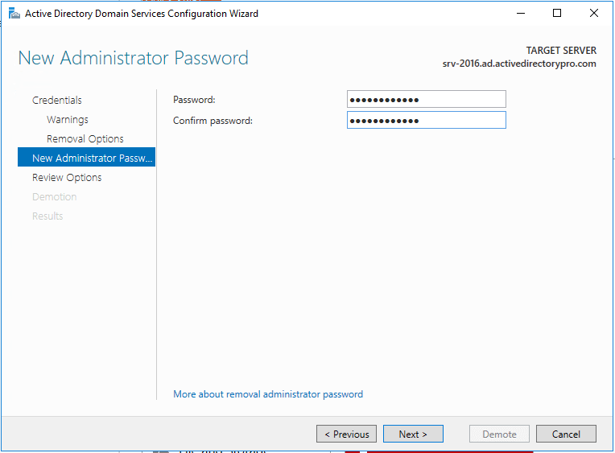

10. Review the summary and click **Demote**. There's a **View Script** button here that generates the equivalent PowerShell — useful if you have more than one DC to demote and want to script the rest.

    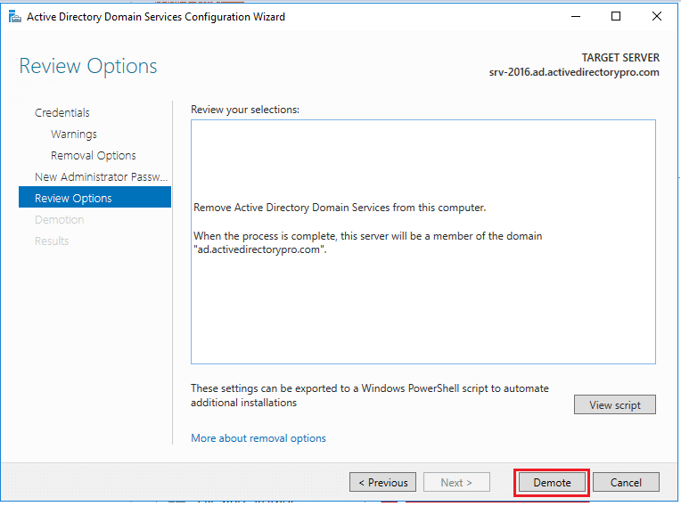

The server reboots and comes back up as a domain member. Metadata cleanup happens automatically as part of this process.

---

## Method 2: Manually Remove via ADUC (Dead / Unreachable DC)

Use this when the server is dead, disconnected, or you no longer have access to it.

1. On another DC or a machine with RSAT tools, open **Active Directory Users and Computers**, go to the **Domain Controllers** OU, right-click the dead DC's computer object, and choose **Delete**.

   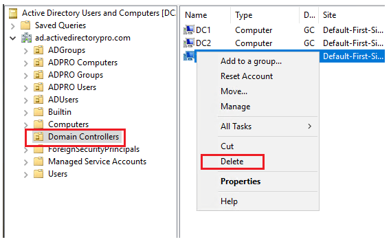

2. On the confirmation dialog, check **"Delete this Domain Controller anyway"** and click Delete.

   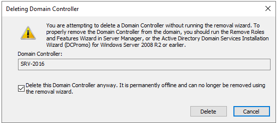

3. If the DC was a Global Catalog server, you'll get an additional confirmation — click Yes.

Since Server 2008, this single deletion also triggers the automatic metadata cleanup behind the scenes — the manual `ntdsutil` process (Method 4) is a fallback, not a required follow-up.

> **RODC note:** For a Read-Only Domain Controller, the confirmation dialog reads **"Delete this Read-only Domain Controller account"** instead. Before deleting, review the RODC's Password Replication Policy — if the RODC was lost or compromised rather than just powered off, treat the accounts it was allowed to cache as potentially exposed and consider resetting those credentials. `Remove-ADComputer` (Method 3 below) doesn't support RODC computer objects, so stick to ADUC or `ntdsutil` for RODC removal.

---

## Method 3: PowerShell (Dead / Unreachable DC, Scripted)

Use this when you want a scriptable equivalent of Method 2 — remote sessions, automation, or no ADUC console handy. It does **not** apply to RODCs (see the note above).

A common misconception: `Remove-ADComputer` by itself doesn't reliably trigger full metadata cleanup — it just deletes the computer account. The actual trigger, per Microsoft's documentation, is deleting the DC's **NTDS Settings** object; that's what ADUC's wizard does behind the scenes, and what Active Directory Sites and Services requires you to do manually before it will let you remove the server object. So the PowerShell equivalent replicates that order explicitly.

Requires the ActiveDirectory PowerShell module (RSAT-AD-PowerShell), run from another DC or a management machine.

1. Locate the DC's server object under the site config and its NTDS Settings object:

```powershell
$dcName = "SERVER200"
$siteServer = Get-ADObject -Filter "Name -eq '$dcName'" -SearchBase "CN=Sites,CN=Configuration,DC=dorg,DC=net" -SearchScope Subtree
$ntdsSettings = Get-ADObject -Filter "objectClass -eq 'nTDSDSA'" -SearchBase $siteServer.DistinguishedName
```

2. Delete the NTDS Settings object first — this is what triggers AD's automatic cross-reference and replication-link cleanup:

```powershell
Remove-ADObject -Identity $ntdsSettings.DistinguishedName -Confirm:$false
```

3. Remove the now-empty server object from the site:

```powershell
Remove-ADObject -Identity $siteServer.DistinguishedName -Confirm:$false
```

4. Remove the computer account from the Domain Controllers OU:

```powershell
Remove-ADComputer -Identity $dcName -Confirm:$false
```

*(Drop `-Confirm:$false` if you want the standard confirmation prompt at each step — recommended unless this is fully unattended.)*

If the DC was a Global Catalog or held FSMO roles, verify both separately afterward — this method doesn't surface the same warnings ADUC's wizard does.

```powershell
Get-ADForest | Select-Object -ExpandProperty GlobalCatalogs
netdom query fsmo
```

---

## Method 4 (Fallback): Manual Metadata Cleanup with ntdsutil

Use this only if Methods 1–3 aren't available or didn't fully clean things up (e.g., the computer object is already gone but AD still shows stale references).

### Step 1: Verify the Failed Domain Controller

```powershell
repadmin /replsummary
```

```powershell
repadmin /showrepl
```

```powershell
dcdiag /v
```

### Step 2: Start ntdsutil

Open an elevated Command Prompt.

```cmd
ntdsutil
```

### Step 3: Enter Metadata Cleanup Mode

```cmd
metadata cleanup
```

### Step 4: Connect to a Healthy Domain Controller

```cmd
connections
```

```cmd
connect to server SERVER100
```

```cmd
q
```

*(Replace `SERVER100` with a healthy, operational DC in your environment.)*

### Step 5: Select the Failed Domain Controller

```cmd
select operation target
```

```cmd
list domains
```

```cmd
select domain 0
```

```cmd
list sites
```

```cmd
select site 0
```

```cmd
list servers in site
```

```cmd
select server 0
```

```cmd
q
```

Double-check the output confirms you selected the **failed** DC, not the healthy one.

### Step 6: Remove the Selected Server

```cmd
remove selected server
```

```cmd
quit
```

```cmd
quit
```

### Full Script (Copy-Paste All Steps)

```cmd
ntdsutil
metadata cleanup
connections
connect to server HEALTHY-DC
q
select operation target
list domains
select domain <NUMBER>
list sites
select site <NUMBER>
list servers in site
select server <NUMBER>
q
remove selected server
quit
quit
```

---

## Additional Cleanup (Applies to All Methods): Sites and Services

Microsoft doesn't automatically clean this up with **any** of the methods above — it's the step most guides skip.

1. Open **Active Directory Sites and Services**.
2. Expand **Sites → [your site] → Servers**.
3. If the removed DC's server object is still listed, right-click it and delete it.

   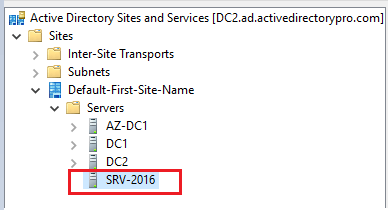

**If this was the only DC in its site**, the site itself doesn't get cleaned up automatically — its subnet associations are now pointing at a site with no DCs left in it. Check `Get-ADReplicationSite` / `Get-ADReplicationSubnet` (or the Subnets node in Sites and Services) and either reassign those subnets to another site or plan to decommission the empty one.

**If the removed DC was a bridgehead server**, any site link relying on it for inter-site replication needs a replacement bridgehead — otherwise replication to/from that site stalls until KCC elects a new one (which it usually does automatically, but don't assume; verify with `repadmin /bridgeheads`).

---

## Post-Cleanup Validation

### 1. Discover Existing DNS Records

Don't assume all three record types exist, or guess the CNAME's GUID — confirm what's actually in DNS before deleting anything.

**A record (forward lookup zone):**

```powershell
Get-DnsServerResourceRecord -ZoneName "dorg.net" -RRType "A" -Name "SERVER200"
```

**PTR record (reverse lookup zone)** — take the IP from the A record above, then check the matching reverse zone:

```powershell
$dcIP = "10.10.10.200"   # from the A record's RecordData.IPv4Address
Get-DnsServerZone | Where-Object ZoneName -like "*.in-addr.arpa" | ForEach-Object {
    Get-DnsServerResourceRecord -ZoneName $_.ZoneName -RRType "Ptr" | Where-Object { $_.RecordData.PtrDomainName -like "SERVER200*" }
}
```

**CNAME record (`_msdcs` zone)** — named by the DC's NTDS Settings **objectGUID**. Capture this *before* you delete the NTDS Settings object in Method 3/4 — once it's gone, AD can't tell you the GUID anymore:

```powershell
$ntdsGuid = (Get-ADObject -Filter "objectClass -eq 'nTDSDSA'" -SearchBase "CN=Sites,CN=Configuration,DC=dorg,DC=net" -SearchScope Subtree -Properties objectGUID |
    Where-Object { $_.DistinguishedName -like "*SERVER200*" }).ObjectGUID
Get-DnsServerResourceRecord -ZoneName "_msdcs.dorg.net" -RRType "CName" -Name $ntdsGuid
```

> **If the NTDS Settings object is already gone** (metadata cleanup ran before you got to DNS), you can't look up the GUID directly. Instead, list every CNAME in the `_msdcs` zone and eliminate the ones belonging to still-active DCs:
> ```powershell
> $activeGuids = Get-ADDomainController -Filter * | ForEach-Object {
>     (Get-ADObject -Identity $_.NTDSSettingsObjectDN -Properties objectGUID).ObjectGUID
> }
> Get-DnsServerResourceRecord -ZoneName "_msdcs.dorg.net" -RRType "CName" | Where-Object { $_.HostName -notin $activeGuids }
> ```
> Whatever's left is orphaned — confirm it doesn't belong to a *different* dead DC before deleting.

Only feed record names you've actually confirmed exist into the removal commands below — don't run all three blindly if discovery only turned up two.

### 2. Remove DNS Records

Three record types to clean up:

- **A record** in the forward lookup zone, named after the server.
- **CNAME record** in the `_msdcs.<forestroot>` zone — this record is named by the DC's NTDS Settings **objectGUID**, not the server name, so look it up before deleting.
- **PTR record** in the relevant reverse lookup zone.

```powershell
Remove-DnsServerResourceRecord -ZoneName "dorg.net" -RRType "A" -Name "SERVER200" -Force
```

```powershell
Remove-DnsServerResourceRecord -ZoneName "_msdcs.dorg.net" -RRType "CName" -Name "<DC-NTDS-GUID>" -Force
```

```powershell
Remove-DnsServerResourceRecord -ZoneName "10.10.10.in-addr.arpa" -RRType "Ptr" -Name "200" -Force
```

### 3. Validate Replication

```powershell
repadmin /replsummary
```

```powershell
repadmin /showrepl
```

```powershell
dcdiag /test:dns
```

```powershell
Get-ADDomainController -Filter *
```

### 4. Confirm No Remaining Metadata

```powershell
Get-ADComputer SERVER200
```

```powershell
Get-ADObject -LDAPFilter "(cn=SERVER200)"
```

## Verification Checklist

- [ ] DC removed via Server Manager, ADUC, PowerShell, or `ntdsutil`
- [ ] Server object removed from Sites and Services
- [ ] Orphaned site/subnet associations reviewed (if last DC in site) or bridgehead replaced (if applicable)
- [ ] DNS A record removed
- [ ] `_msdcs` CNAME removed
- [ ] PTR record removed
- [ ] AD replication healthy
- [ ] `dcdiag` passes

## Summary

If the DC is reachable, demote it gracefully through Server Manager — Microsoft's recommended path. If it's dead, delete the computer object in ADUC (or the PowerShell equivalent if you're scripting it); since Server 2008 this triggers metadata cleanup automatically, as long as the NTDS Settings object gets deleted along the way. Fall back to manual `ntdsutil` cleanup only when none of those fully clear the stale references. RODCs follow a slightly different removal flow — see the note under Method 2. Whichever path you take, don't forget Sites and Services and the site/subnet fallout — it's the step most commonly left behind.

## References

- [Active Directory Pro — How to Demote a Domain Controller](https://activedirectorypro.com/demote-domain-controller/)
- [Microsoft Learn — Clean up AD DS server metadata](https://learn.microsoft.com/en-us/windows-server/identity/ad-ds/deploy/ad-ds-metadata-cleanup)


